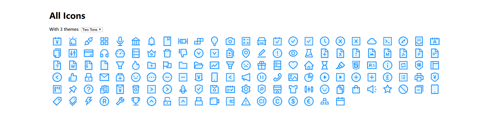

<h1 align="center">
Ant Design Icons for Angular
</h1>

<div align="center">

[](https://npmjs.org/package/@ant-design/icons-angular)
[](https://npmjs.org/package/@ant-design/icons-angular)

</div>

> With a better taste.





## Installation

```bash
ng add @ant-design/icons-angular

# or npm install @ant-design/icons-angular
```

## Usage

You should import `IconModule` in your application's root module.

```ts
import { IconModule } from '@ant-design/icons-angular';

@NgModule({
  imports: [
    IconModule
  ]
})
export class AppModule { }
```

And register the icons that you need to `IconService` (all or explicitly, we call it **static loading**):

> ATTENTION! We strongly suggest you not to register all icons. That would increase your bundle's size dramatically.

```ts
import { Component, OnInit } from '@angular/core';
import { IconDefinition, IconService } from '@ant-design/icons-angular';
import { AccountBookFill } from '@ant-design/icons-angular/icons'
// import * as AllIcons from 'ant-icons-angular/icons';

@Component({
  selector   : 'app-root',
  templateUrl: './app.component.html',
  styleUrls  : ['./app.component.css']
})
export class AppComponent implements OnInit {
  constructor(private _iconService: IconService) {
    // Import all. NOT RECOMMENDED. ❌
    // const antDesignIcons = AllIcons as {
      // [key: string]: IconDefinition;
    // };
    // this._iconService.addIcon(...Object.keys(antDesignIcons).map(key => antDesignIcons[key]));
    // Import what you need! ✔️
    this._iconService.addIcon(...[ AccountBookFill ]);
    this._iconService.twoToneColor = { primaryColor: '#1890ff' };
  }
}
```

When you want to render an icon:

```html
<i antIcon type="ant-cloud" theme="outline"></i>
```

Checkout the demo for more details.

For icons provided by Ant Design, we provide **dynamic loading** strategy to reduce bundle's size. Just config your `angular.json` and you even don't need to register the icons! Checkout our `examples` dir and `angular.json` file for more details.

### Directive Inputs

```ts
class IconDirevtive {
  @Input() type: string | StringifyIconDefinition;
  @Input() theme: ThemeType;
  @Input() twoToneColor: string;
}
```

## Development

This package, unlike `@ant-design/icons-react`, does not list `@ant-design/icons` as a dependency. It has its own build up tooling chain which brings benefits like:

* **Tree shake**.
* Providing dynamic and static loading.
* Reduced bundle size (500KB less if you only use dynamic loading).
* Better performance because of no `svg => abstract node => svg` process.

### Build

Build the library by running the script we provide.

```bash
$ ./build.sh
```

### Demo

Since the demo use packaged `@ant-design/icons-angular`, you should build the library before you run `ng serve`.

### Extension

You can simply extend this package by creating directives or services that extends `IconDirective` and `IconService`. And it is worth mentioning that `_changeIcon` method returns a `Promise<svg>` using which you could add extra modifications. [ng-zorro-antd](https://github.com/NG-ZORRO/ng-zorro-antd/tree/master/components/icon) is a good example of extending this package.
